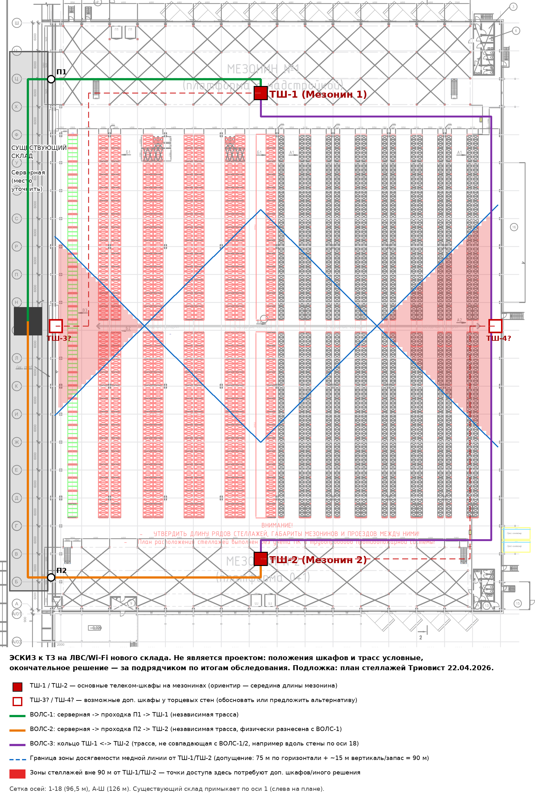

# Техническое задание на проектирование и построение ЛВС и беспроводной сети Wi‑Fi нового складского корпуса

| Параметр | Значение |
|---|---|
| Объект | Складской корпус со вспомогательными помещениями (пристройка к существующему складу) |
| Адрес | Республика Беларусь, Минский р‑н, Хатежинский с/с, район д. Таборы |
| Заказчик | [наименование организации — заполнить]; контактное лицо: Руслан, продакт-менеджер |
| Версия документа | 0.2 (черновик для запроса коммерческих предложений; учтены ответы заказчика от 27.09.2026) |
| Ведущий инженер проекта (ГИП) | [ФИО, контакты — заполнить]; к нему — вопросы по строительной части, электропитанию и смежным разделам |
| Дата | [заполнить] |

**Ключевые решения заказчика (обязательны для подрядчика):** активное оборудование — **только Huawei** (как ядро сети основного склада); Wi‑Fi управляется **существующим контроллером на коммутаторе ядра основного склада**; в сети есть **устаревшие клиенты Wi‑Fi 4 (802.11n) только 2,4 ГГц** — диапазон 2,4 ГГц обязателен; **видеонаблюдение и СКУД — вне объёма** (проектируются отдельно).

**Как читать документ.** Всё, что установлено по чертежам, приведено со ссылкой на источник. Всё, что по чертежам установить нельзя, помечено как **[Допущение]** (принято для расчёта КП, подрядчик обязан проверить) или **[Вопрос]** (см. раздел 17 «Открытые вопросы к заказчику»). Подрядчик вправе предложить альтернативные технические решения при условии их обоснования.

---

## 1. Термины и сокращения

| Сокращение | Значение |
|---|---|
| ЛВС | Локальная вычислительная сеть |
| СКС | Структурированная кабельная система |
| ВОЛС | Волоконно-оптическая линия связи |
| ТШ | Телекоммуникационный шкаф |
| ТД | Точка доступа Wi‑Fi |
| ТСД | Терминал сбора данных (мобильный сканер/компьютер кладовщика, в т.ч. установленный на погрузчике) |
| ИБП | Источник бесперебойного питания |
| PoE | Питание устройств по витой паре (IEEE 802.3af/at/bt) |
| RSSI | Уровень принимаемого сигнала, дБм |
| SNR | Отношение сигнал/шум, дБ |
| APoS | «AP-on-a-stick» — натурное обследование с временной установкой ТД |
| ИД | Исполнительная документация |
| КП | Коммерческое предложение |

---

## 2. Цели и задачи

**Цель:** обеспечить новый складской корпус надёжной проводной и беспроводной сетью, интегрированной в существующую ЛВС основного склада, для работы складских процессов (ТСД, рабочие места, печать этикеток и т.п.).

**Задачи подрядчика:**

1. Провести предпроектное радиообследование (моделирование + натурное) и по его результатам определить количество, места установки, модель ТД и антенн.
2. Разработать проект ЛВС, СКС и Wi‑Fi (в объёме, достаточном для монтажа и согласования с заказчиком и смежными подрядчиками).
3. Поставить материалы и оборудование (в согласованном с заказчиком объёме).
4. Выполнить монтаж СКС, ВОЛС, ТШ, активного оборудования, ТД.
5. Выполнить пусконаладку, интеграцию с существующей сетью и системой управления Wi‑Fi.
6. Провести приёмочные испытания (сертификационное тестирование СКС и ВОЛС, приёмочное радиообследование, тесты роуминга ТСД).
7. Передать исполнительную документацию и обучить персонал заказчика.

**Критерии успеха:**

- ТСД работают без обрывов сессий во всех рабочих зонах, включая проходы между заполненными стеллажами и зоны под/на мезонинах.
- Отказ одной оптической линии или одного узла агрегации не приводит к потере связи склада с серверной.
- Каждая медная линия СКС — не длиннее норматива (90 м постоянной линии, 100 м канала) и сертифицирована.

---

## 3. Описание объекта (по исходным чертежам)

### 3.1. Исходные материалы

| № | Документ | Что содержит |
|---|---|---|
| 1 | Комплект 625‑26‑п‑КМ «Металлоконструкции мезонинов» (ПГС‑Инжиниринг, 07.2026), 8 листов, файл `sklad-obshaya-shema.pdf` | Общие данные, габариты и отметки мезонинов, схемы колонн, балок, лестниц |
| 2 | План расположения стеллажей Триовист, 22.04.2026, на подложке 11‑04/25‑1‑АР, файл `triovist-frontalnye-22.04.2026-(1)-model-6.pdf` | План корпуса в осях, мезонины, ряды стеллажей, экспликация помещений |
| 3 | Виды стеллажей Триовист, файл `triovist-frontalnye-22.04.2026-(2)-model-3.pdf` | Высоты рам, ярусы, нагрузки, спринклерная защита в стеллажах |
| 4 | Чертёж DWG `triovist-frontalnye-22.04.2026-(1)(4).dwg` | Исходник документов 2–3 (конвертирован; содержит те же данные) |

Заказчик передаёт подрядчику исходные DWG/PDF. **Важно:** на плане стеллажей стоит пометка разработчика «Утвердить длину рядов стеллажей, габариты мезонинов и проездов между ними» и «План выполнен без учёта ПК и трубопроводов противопожарной системы» — т.е. раскладка стеллажей **не финальная**. Подрядчик обязан работать по актуальной на момент проектирования версии и учесть возможные изменения.

### 3.2. Здание

| Параметр | Значение | Источник |
|---|---|---|
| Габарит корпуса в осях | ~96,5 м (оси 1–18) × 126 м (оси А–Ш) | План Триовист |
| Шаг колонн | 6 м в обоих направлениях (крайние пролёты 2,0 и 4,5 м по осям 1–3) | План Триовист |
| Площадь помещения «Склад» | 11 994,11 м², категория В1 / П II | Экспликация помещений |
| Примыкание к существующему складу | По оси 1 (слева на плане) — корпус пристроен вплотную | План Триовист (надпись «Сущ. склад») |
| Отметка чистого пола | 0,000 (абс. +268,50) | КМ, лист 1.1 |
| Высотная отметка над стеллажами | +13,200 (показана на видах стеллажей; зазор ~1 м над верхом рам) | Виды Триовист |
| Ворота / доки | Группа доковых ворот вдоль торцевой стены у Мезонина 1 (ось Ш) и группа ворот у Мезонина 2 (ось А) | План Триовист |
| Вспомогательные помещения | Санузлы, тамбуры, коридор, помещение обогрева, **электрощитовая (5,67 м², у Мезонина 2, торец у оси 18)**, венткамера, площадки для курения, площадка для брака (150 м², у стены по оси 18) | Экспликация |

**[Допущение]** Отметка +13,200 трактуется как низ несущих конструкций покрытия/предельная высота; фактическая высота до низа ферм, расположение ферм, светильников, спринклерных магистралей и вентиляции — уточнить по разделам АР/КМ здания, ОВ, АУПТ, ЭО (не переданы). **[Вопрос 17.2]**

**[Допущение]** Наличие отопления склада не установлено; наличие «помещения обогрева» может указывать на неотапливаемый/холодный склад. От этого зависят требования к исполнению оборудования и шкафов. **[Вопрос 17.3]**

### 3.3. Мезонины

| Параметр | Мезонин 1 | Мезонин 2 |
|---|---|---|
| Расположение | У торцевой стены по оси Ш (верх плана), оси ~Х–Ш / 2–18 | У торцевой стены по оси А (низ плана), оси А–В(Г) / 2–18 |
| Тип (по плану Триовист) | «Платформа с надстройкой» | «Платформа 0+1» |
| Размер в плане по КМ | 93,8 × 17,35 м | 92,9 × 11,35 м |
| Размер по плану Триовист | ~87,45 × 16,86 м | ~87,45 × 12,7 м |
| Отметка пола мезонина | +4,000 (монолитная ж/б плита) | +4,000 |
| Низ балок (высота под мезонином) | +3,560 | +3,560 |
| Лестницы | С двух торцов | С двух торцов |
| Нормативная технологическая нагрузка | 15 кН/м² | 15 кН/м² |

Размеры в КМ и на плане Триовист расходятся (разные стадии/подложки) — подрядчику использовать актуальный согласованный чертёж. **[Вопрос 17.2]**

Что находится на мезонинах и под ними (офисы, зоны комплектации, упаковки, сортировки), а также что входит в «надстройку» Мезонина 1 — по чертежам не определено. **[Вопрос 17.4]**

### 3.4. Стеллажная зона

| Параметр | Значение | Источник |
|---|---|---|
| Зона стеллажей | Между мезонинами, примерно оси Г–Ф (~84 м) по длине, оси 2–18 по ширине | План Триовист |
| Ориентация рядов | Ряды параллельны осям 1–18 (перпендикулярно мезонинам), две половины по ~39,95 м с проездными (арочными) секциями посередине | План Триовист |
| Состав рядов (ориентировочно) | 1 одинарный ряд вдоль стены по оси 1; ~5 сдвоенных рядов с глубокими паллетоместами (проходы ~4,2–4,9 м); ~8 сдвоенных рядов под европаллеты (глубина ряда 2 × 1,1 м, проходы ~3,35 м) | План Триовист (подсчёт по чертежу, уточнить) |
| Высота рам | 12 200 мм, до 6 ярусов, верхний уровень хранения ~+10,3…+10,9 м | Виды Триовист |
| Шаг секции | 2 700 мм; нагрузка до 1 000 кг на паллету, до 3 000 кг на ярус, до 15 000 кг на раму | Виды Триовист |
| Особенности | Внутристеллажное спринклерное пожаротушение (балки-защиты спринклера, противопожарные экраны), сетчатые настилы, проездные секции и эвакуационные проходы | Виды Триовист |

**Значение для радио:** плотные металлические стеллажи высотой 12,2 м с паллетами создают «каньоны» — сигнал между соседними проходами сильно ослаблен, покрытие каждого прохода фактически нужно обеспечивать отдельно. Уровень затухания зависит от **товара** (жидкости, металл, фольгированная упаковка поглощают/отражают сигнал) и **заполненности стеллажей**. **[Вопрос 17.5]**

### 3.5. Эскиз размещения шкафов и трасс

Файл: `media/eskiz-shkafy-trassy.png`. Эскиз иллюстрирует вводные заказчика и проблему длины медных линий; он **не является проектным решением**.

Оценка по эскизу: при размещении ТШ‑1 и ТШ‑2 примерно посередине длины мезонинов и допущении «≈75 м по горизонтали + ≈15 м на подъём от пола мезонина (+4,0) к лоткам под покрытием, спуск к ТД и запас» центральная часть стеллажной зоны у стен по осям 1 и 18 (красные зоны) **не достигается медной линией 90 м**. Значит, для точек доступа в средней части склада потребуются дополнительные ТШ (например, ТШ‑3/ТШ‑4 у стен по осям 1 и 18) или иное решение — подрядчик обязан обосновать (см. п. 6.4).

---

## 4. Границы работ

### 4.1. Входит в объём подрядчика

1. Предпроектное радиообследование (моделирование и натурное) — раздел 9.
2. Проектирование ЛВС, СКС, Wi‑Fi, кабеленесущих систем. По электропитанию ТШ подрядчик **выдаёт задание на смежный раздел** (электрические нагрузки ТШ, количество и места линий 230 В, требования к заземлению) ведущему инженеру проекта (ГИП); прокладку линий питания до ТШ выполняет электромонтажная организация по проекту электроснабжения, если заказчик не решит иначе.
3. Две независимые ВОЛС от серверной существующего склада до ТШ‑1 и ТШ‑2 и ВОЛС ТШ‑1 ↔ ТШ‑2 (кольцо), включая проходки через стену между корпусами с восстановлением предела огнестойкости.
4. Кабеленесущие системы (лотки, трубы, крепёж) для трасс ЛВС в новом корпусе и в существующем здании до серверной.
5. Поставка и монтаж ТШ, коммутационного оборудования (патч-панели, оптические кроссы, органайзеры), ИБП, систем заземления ТШ.
6. Медные линии СКС: рабочие места на мезонинах (40 шт.), ТД, резервные/прочие точки по согласованному перечню.
7. Поставка (см. 4.3), монтаж и настройка коммутаторов Huawei и ТД Huawei; подключение ТД к существующему контроллеру Wi‑Fi на коммутаторе ядра основного склада (настройка профилей, SSID, радиопараметров, лицензий ТД).
8. Интеграция с существующей ЛВС (ядро, VLAN, маршрутизация, аутентификация, мониторинг) по согласованию с ИТ заказчика.
9. Испытания и приёмка: сертификация СКС и ВОЛС, приёмочное радиообследование, тест роуминга ТСД.
10. Исполнительная документация, обучение, гарантийное обслуживание.
11. Вывоз строительного мусора и упаковки, уборка зон работ.
12. Средства подмащивания и подъёмники для работ на высоте до ~13 м (включить в КП или указать как обязательство заказчика).

### 4.2. Не входит в объём (если не заказано отдельно)

- **Видеонаблюдение и СКУД — полностью вне объёма** (проектируются заказчиком отдельно). Подрядчик ЛВС только закладывает резерв ёмкости лотков (п. 6.5) и не занимает трассы, которые понадобятся этим системам, без согласования.
- Охранная и пожарная сигнализация, IP‑телефония — вне объёма; при необходимости — опциональные линии по цене за единицу (п. 16).
- Монтаж силовых распределительных сетей здания (кроме линий питания ТШ — по согласованию).
- Поставка ТСД, ПК, принтеров.
- Изменения в существующей серверной сверх подключения новых ВОЛС (при необходимости — отдельной позицией).

### 4.3. Варианты поставки оборудования

Подрядчик указывает в КП раздельно:

- (а) СКС и пассивная часть — поставка подрядчиком;
- (б) активное оборудование **Huawei** (коммутаторы, ТД, оптические модули, лицензии ТД на существующем контроллере) — поставка подрядчиком **или** поставка заказчиком с монтажом/настройкой силами подрядчика.

Решение по варианту (б) — за заказчиком (КП дать в обоих вариантах). Оборудование других производителей для активной части не допускается. Выбор производителя пассивной СКС (кабель, панели, кроссы) — за подрядчиком, с обоснованием.

---

## 5. Общие требования и нормативная база

1. Работы выполнять в соответствии с действующими ТНПА Республики Беларусь (ТКП, СТБ, ПУЭ, требования пожарной безопасности) и международными стандартами на СКС: ISO/IEC 11801‑1, ISO/IEC 14763‑2 (проектирование и монтаж), IEC 61935‑1 (тестирование медных линий), ISO/IEC 14763‑3 (тестирование оптики), ANSI/TIA‑568.2‑D / 568.3‑D, ANSI/TIA‑606 (маркировка), ANSI/TIA‑607 (заземление) — в части, не противоречащей ТНПА РБ.
2. Оборудование и материалы — новые, с документами о соответствии требованиям ЕАЭС / ТНПА РБ (в т.ч. ТР ТС 020/2011 для радиоэлектронного оборудования), с официальной гарантией производителя в РБ.
3. Радиооборудование — с допуском к применению в РБ; частотные каналы и мощность — в пределах, разрешённых в РБ. Подрядчик подтверждает допустимость использования диапазона 6 ГГц в РБ либо проектирует без него.
4. Кабельная продукция внутри здания — не распространяющая горение, с низким дымо- и газовыделением (исполнение LSZH / нг(А)‑HF или эквивалент по ТНПА РБ).
5. Работы на высоте — персоналом с допуском, с оформлением нарядов-допусков; согласование графика с генподрядчиком и монтажником стеллажей.
6. **Запрещено** сверлить, варить и крепить что-либо к стеллажам без письменного согласования с поставщиком стеллажей (Триовист) и заказчиком; крепления к металлоконструкциям мезонинов и здания — по согласованию с проектировщиком КМ/генподрядчиком.
7. Трассы и места установки ТД согласовываются со смежными системами: спринклерное пожаротушение (в т.ч. внутристеллажное), освещение, вентиляция, зоны работы погрузчиков, эвакуационные пути.

---

## 6. Требования к СКС

### 6.1. Топология

- Иерархическая звезда: серверная существующего склада (ядро) → ТШ нового корпуса (узлы доступа/агрегации) → абонентские линии.
- Минимум два ТШ: **ТШ‑1 на Мезонине 1** и **ТШ‑2 на Мезонине 2**. Размещение по длине мезонина выбрать так, чтобы все рабочие места на мезонине и максимум ТД укладывались в норматив длины (ориентир — середина мезонина). Окончательно — по проекту.
- Необходимость дополнительных ТШ (ТШ‑3, ТШ‑4 и т.д.) подрядчик **обязан обосновать** расчётом длин линий по реальным трассам (с учётом подъёма к лоткам под покрытием и спусков), см. п. 6.4.

### 6.2. Магистральная оптика (ВОЛС)

| Линия | Откуда → куда | Требования |
|---|---|---|
| ВОЛС‑1 | Серверная существующего склада → ТШ‑1 | Одномодовое волокно OS2, **12 волокон**; своя трасса и своя проходка в стене |
| ВОЛС‑2 | Серверная существующего склада → ТШ‑2 | OS2, **12 волокон**; трасса и проходка **физически разнесены** с ВОЛС‑1 (разные лотки, разные проходки, по возможности с разных сторон серверной) |
| ВОЛС‑3 (кольцо) | ТШ‑1 ↔ ТШ‑2 | OS2, **12 волокон**; трасса не должна совпадать с ВОЛС‑1/ВОЛС‑2 (например, вдоль стены по оси 18) |
| ВОЛС к доп. ТШ (если будут) | ТШ‑1/ТШ‑2 → ТШ‑3/ТШ‑4 | OS2, 8–12 волокон; двойное подключение каждого доп. ТШ (к ТШ‑1 и ТШ‑2) |

**Итого минимум: 3 оптических кабеля по 12 волокон OS2** (2 из серверной + 1 кольцевой), плюс по 2 кабеля на каждый дополнительный ТШ, если он потребуется.

Обоснование ёмкости: один канал 10 Гбит/с занимает 2 волокна. В каждый ТШ заводятся 2 канала (к двум коммутаторам ядра или агрегированный LAG) — это 4 волокна. Ещё 4 волокна нужны для транзита к возможным ТШ‑3/ТШ‑4 или для расширения, 4 остаются резервом на повреждение. Разница в цене между 8 и 12 волокнами невелика, а дотянуть кабель позже намного дороже. Подрядчик вправе обосновать большую ёмкость (16–24 волокна).

Дополнительно:

- Тип кабеля — для внутренней прокладки (или универсальный in/outdoor), LSZH, с защитой от грызунов при прокладке в зонах риска; при прокладке по наружной стене/между зданиями вне помещения — кабель соответствующего исполнения.
- Оконцевание — сварка пигтейлов в оптических кроссах 19", разъёмы **LC/UPC** **[Допущение — сверить с оптическими кроссами и модулями существующего ядра Huawei, Вопрос 17.7]**; запас кабеля в ТШ и в серверной не менее 3–5 м.
- Трассы — в лотках/трубах, отдельно от силовых кабелей; радиус изгиба — по паспорту кабеля.
- Проходки через стену между корпусами (заказчик подтверждает, что сверление допустимо) — в гильзах с заделкой сертифицированными огнезащитными материалами с пределом огнестойкости не ниже, чем у стены (**[Вопрос 17.10]**: является ли стена противопожарной).
- Серверная находится в основном складе, к которому примыкает новый корпус. Точное место серверной, длину трасс и наличие лотков в основном складе подрядчик определяет при обследовании объекта (этап 1).

### 6.3. Медная горизонтальная подсистема

| Параметр | Требование |
|---|---|
| Категория для ТД | **Cat.6A** (класс EA), экранированная (F/UTP или U/FTP) — под multigigabit (2,5/5 Гбит/с) для ТД Wi‑Fi 6/6E/7 |
| Категория для рабочих мест | Не ниже Cat.6 (класс E); допускается Cat.6A единой системой — указать цену обоих вариантов |
| Экранирование | Единое решение для всей системы (экран — с заземлением через ТШ) |
| Длина | Постоянная линия ≤ 90 м, канал ≤ 100 м. Линии длиннее — недопустимы |
| Исполнение | LSZH / нг(А)-HF |
| Производитель | Единая система одного производителя (кабель, модули, панели, шнуры) с возможностью получения системной гарантии производителя |
| Рабочие места | **До 20 на каждом мезонине (до 40 всего) — предварительно, с запасом**; фактическое количество, скорее всего, будет заметно меньше и уточняется после планировки мезонинов. КП считать на 20 + 20, **с ценой за одно рабочее место**, чтобы итог можно было пересчитать. **[Допущение]** по 2 порта RJ45 на рабочее место; тип розеток — **[Вопрос 17.4]** |
| ТД | Одна линия на ТД **[Допущение; для ТД с двумя uplink — 2 линии]**, оконцевание у ТД — розетка/коннектор полевой заделки в защитной коробке; патч-корд до ТД |
| Резерв | Не менее 20% свободных портов на патч-панелях и 20% запаса ёмкости лотков |
| Прочие точки | Принтеры этикеток, стационарные сканеры, доковые рабочие места, зарядные станции ТСД с Ethernet — по перечню заказчика **[Вопрос 17.6]**; в КП — цена за единицу линии. Камеры и СКУД — вне объёма |

### 6.4. Обоснование количества ТШ (обязательный пункт проекта)

Подрядчик в проекте (и в укрупнённом виде — в КП) приводит:

1. Трассировку всех линий к ТД и рабочим местам с реальными длинами (горизонталь по лоткам + вертикальные подъёмы/спуски + запасы).
2. Проверку, что ни одна постоянная линия не превышает 90 м.
3. Если с ТШ‑1/ТШ‑2 это невыполнимо — сравнение минимум двух вариантов, например: (а) дополнительные ТШ у стен по осям 1 и/или 18 в средней части склада с оптическим подключением; (б) промышленные коммутаторы в защищённых боксах в зоне стеллажей; (в) иное решение. Сравнение — по стоимости, надёжности, удобству обслуживания, требованиям к питанию и безопасности на высоте.
4. Для доп. ТШ — место установки должно быть доступно для обслуживания без подъёмника, защищено от ударов погрузчиков, обеспечено питанием.

### 6.5. Кабеленесущие системы

- Металлические лотки (проволочные или перфорированные) с крышками на участках риска механических повреждений; заполнение не более 50% после монтажа (с учётом резерва).
- Основные магистрали — по стенам и/или под покрытием выше отметки верха стеллажей (зазор над рамами ~1 м — согласовать отметки с АУПТ, освещением, вентиляцией); пересечение проходов — только поверху, без помех для погрузчиков.
- Спуски к ТД и оборудованию — в гофротрубе/металлорукаве или в лотке.
- На мезонинах — лотки под плитой мезонина/по ограждению/в кабель-каналах к рабочим местам (решение — проектом).
- Заземление и уравнивание потенциалов металлических лотков.
- Разделение слаботочных и силовых трасс по нормам (расстояния/перегородки).

### 6.6. Маркировка

- По ANSI/TIA‑606 (или эквивалентной схеме, согласованной с заказчиком): ТШ, патч-панели, порты, розетки, оба конца каждого кабеля, оптические кроссы и волокна, ТД (метка с идентификатором, видимая с пола), лотки на поворотах и проходках.
- Маркировка — промышленные термоусадочные/ламинированные этикетки, стойкие к истиранию; ручные надписи не допускаются.
- Схема идентификаторов согласуется с ИТ заказчика до начала монтажа (увязка с существующей маркировкой основного склада).

---

## 7. Требования к телекоммуникационным шкафам

| Параметр | Требование |
|---|---|
| Тип | Напольный 19", **не менее 42U**, глубина **не менее 1000 мм** (под коммутаторы и ИБП), ширина 800 мм предпочтительно (кабельные органайзеры по бокам) — окончательно по проекту |
| Исполнение | Закрывающиеся двери с замком (передняя — перфорированная или стекло/сталь, задняя — перфорированная); боковые стенки съёмные с замками. При запылённости/перепадах температур — шкаф с повышенной степенью защиты (IP54) и климат-контролем **[Вопрос 17.3]** |
| Размещение | На мезонинах, вне путей эвакуации и зон перемещения грузов; защита от ударов (отбойники) при необходимости; проверка несущей способности плиты — нагрузка шкафа с ИБП и АКБ до ~500 кг (мезонин рассчитан на 15 кН/м²) |
| Вентиляция | Вентиляторные модули с термостатом; расчёт тепловыделения активного оборудования и ИБП; допустимый температурный диапазон оборудования — подтвердить для условий склада |
| Заполнение (минимум) | Оптический кросс; патч-панели с органайзерами; коммутаторы доступа/агрегации; ИБП; блок розеток (PDU) 19"; полка; резерв ≥ 30% юнитов |
| Питание | Выделенная линия 230 В на каждый ТШ (ориентировочно — от электрощитовой нового корпуса), отдельный автомат и УЗО/дифавтомат по нормам; по возможности — от щита гарантированного питания. Подрядчик ЛВС выдаёт ГИП задание с нагрузками (кВт) и местами ТШ; линии выполняются по проекту электроснабжения **[Вопрос 17.9]** |
| ИБП | Онлайн (двойное преобразование), стоечный, с сетевой картой SNMP/HTTPS для мониторинга; мощность — по расчёту с запасом ≥ 25% от максимального потребления (включая полный PoE-бюджет); автономность — **не менее 30 минут [Допущение, Вопрос 17.9]**; внешний байпас при возможности |
| Заземление | Шина заземления в каждом шкафу, подключение к главной заземляющей шине/контуру здания медным проводником сечением по расчёту/нормам; заземление экранов СКС через патч-панели; протокол измерения сопротивления заземления |
| Доступ | Ключи — у заказчика; перечень лиц с доступом — по согласованию |

---

## 8. Требования к активному оборудованию

### 8.1. Общие

- Производитель — **только Huawei**, так же как ядро сети основного склада. Модели коммутаторов, ТД и модулей подрядчик подбирает с обоснованием; при наличии нескольких подходящих линеек — 2 варианта (например, базовый и с запасом по производительности) с полной стоимостью владения на 5 лет (оборудование, лицензии, сервисная поддержка).
- Обязательная проверка совместимости с существующим ядром Huawei: модели и версия ПО ядра, оптические модули, протоколы резервирования, функции контроллера Wi‑Fi (п. 9.6). При необходимости обновить ПО ядра — указать это в КП отдельно, с оценкой рисков и окном работ.
- Совместимость с существующим ядром сети и системой управления заказчика (VLAN 802.1Q, LACP 802.3ad, STP/RSTP/MSTP или ERPS, LLDP, SNMPv3, Syslog, NTP, 802.1X/RADIUS, ACL, QoS DSCP/802.1p).
- Централизованное управление в существующей инфраструктуре Huawei заказчика (система управления/NMS — **[Вопрос 17.11]**), резервное копирование конфигураций.
- Все компоненты — с действующей гарантией/сервисным контрактом производителя; указать сроки End-of-Sale/End-of-Support (не ранее 5 лет с даты поставки).

### 8.2. Коммутаторы доступа (в ТШ)

| Параметр | Требование |
|---|---|
| Порты под ТД | Multigigabit 1/2.5/5 Гбит/с (а при необходимости 10GBASE-T) с PoE+ (802.3at) или PoE++ (802.3bt) — по требованиям выбранной модели ТД |
| Порты под рабочие места | 1 Гбит/с (PoE — по перечню устройств: IP‑телефоны, камеры) |
| Uplink | Не менее 2 × 10 Гбит/с SFP+ (или 25 Гбит/с) на каждый коммутатор/стек; оптические модули — в комплекте |
| Резервирование | Стек или MLAG внутри ТШ; два блока питания (или резервный БП) у коммутаторов ядра/агрегации ТШ; uplink из каждого ТШ — в две независимые ВОЛС (к серверной и через кольцо) |
| PoE-бюджет | Не менее суммы максимальных классов мощности всех подключённых PoE‑устройств **+ 30% резерв**; расчёт — в проекте |
| L3 | Статическая маршрутизация/OSPF — по архитектуре, согласованной с ИТ заказчика |
| Порты | Суммарный резерв свободных портов ≥ 20% |

### 8.3. Отказоустойчивость

- Схема: серверная ↔ ТШ‑1 (ВОЛС‑1), серверная ↔ ТШ‑2 (ВОЛС‑2), ТШ‑1 ↔ ТШ‑2 (ВОЛС‑3) — логическое кольцо. При обрыве любой одной ВОЛС или отказе одного ТШ другая половина склада сохраняет связь с серверной.
- Время сходимости при обрыве линии — **не более 1 с [Допущение, целевое; уточнить требования WMS]**; протокол (RSTP/MSTP, ERPS, L3 с ECMP и т.п.) — по проекту, согласованному с ИТ заказчика.
- В серверной существующего склада — подключение ВОЛС‑1 и ВОЛС‑2, по возможности, к разным коммутаторам ядра (**[Вопрос 17.7]**).
- Отказ одной ТД не должен приводить к «мёртвой зоне»: в рабочих зонах ТСД — покрытие минимум двумя ТД (см. 9.3).

### 8.4. Сетевая сегментация (предварительно)

Отдельные VLAN/SSID для: ТСД; проводных рабочих мест; управления сетевым оборудованием; гостевого доступа (если нужен); видеонаблюдения/СКУД/принтеров (если будут). Окончательная схема и IP‑план — согласовать с ИТ заказчика.

---

## 9. Требования к беспроводной сети Wi‑Fi

### 9.1. Зоны покрытия

| Зона | Требование |
|---|---|
| Проходы между стеллажами (все, на всю длину, включая проездные секции) | Покрытие для ТСД (профиль «ТСД», п. 9.3) |
| Проезды и зоны вдоль мезонинов, зоны приёмки/отгрузки у ворот | Профиль «ТСД» |
| Под мезонинами (высота ~3,56 м, ж/б плита сверху) | Профиль «ТСД» |
| На мезонинах (рабочие места, зоны комплектации — **[Вопрос 17.4]**) | Профиль «ТСД» + офисные клиенты (ноутбуки) |
| Вспомогательные помещения (обогрев, санузлы, тамбуры, электрощитовая, венткамера) | Не требуется **[Допущение]** |
| Площадка для брака (150 м²), площадки у ворот снаружи | **[Вопрос 17.4]** |

Высота расчёта покрытия — **1,0–1,5 м от пола** (уровень ТСД в руке/на погрузчике). Если ТСД используются на высоте (оператор поднимается на погрузчике — man-up/VNA), покрытие также на рабочей высоте подъёма — **[Вопрос 17.1]**.

Модель расчёта — **с заполненными стеллажами** (худший случай), с учётом реального типа товара.

### 9.2. Частотные диапазоны и стандарты

- ТД — не ниже **Wi‑Fi 6 (802.11ax)**; рассмотреть Wi‑Fi 6E/7, если ТСД заказчика поддерживают 6 ГГц и диапазон разрешён в РБ.
- **Основной диапазон для ТСД — 5 ГГц**; каналы шириной **20 МГц** (для плотного частотного плана и устойчивого роуминга); 40 МГц — только при обосновании.
- **2,4 ГГц — обязателен:** у заказчика есть устаревшие клиенты **Wi‑Fi 4 (802.11n), работающие только в 2,4 ГГц**. Требования: каналы только 1/6/11, ширина 20 МГц, мощность согласована с 5 ГГц. В плотной сетке ТД часть радиомодулей 2,4 ГГц отключается или переводится в режим мониторинга, чтобы не было взаимных помех. Покрытие 2,4 ГГц — во всех зонах, где работают эти устройства (**[Вопрос 17.1]**: какие устройства, сколько и где; по умолчанию — все зоны профиля «ТСД»).
- Режим совместимости с 802.11n на 2,4 ГГц не должен ухудшать работу современных клиентов на 5 ГГц: современные ТСД направляются в 5 ГГц (band steering или отдельный SSID), а для 2,4 ГГц используется отдельный SSID/профиль, если это нужно устаревшим устройствам.
- Частотный план — без взаимных помех соседних ТД (co-channel interference) с учётом DFS-каналов; если ТСД плохо работают с DFS — план только на не-DFS каналах (**[Вопрос 17.1]**).
- Мощность ТД — согласована с мощностью ТСД (избегать асимметрии: ТСД слышит ТД, а ТД не слышит ТСД).
- Отключить низкие скорости передачи (минимальная базовая скорость — например, 12 Мбит/с на 5 ГГц) — по согласованию с поддерживаемыми ТСД.

### 9.3. Целевые параметры радиопокрытия (профиль «ТСД»)

| Параметр | Требование |
|---|---|
| Уровень сигнала от основной ТД (Primary RSSI) | **≥ −67 дБм** в 95% площади рабочих зон, по каждому проходу — **в 5 ГГц и в 2,4 ГГц** (для зон, где работают устройства Wi‑Fi 4) |
| Уровень сигнала от второй ТД (Secondary RSSI) | **≥ −70…−72 дБм** (для бесшовного роуминга и отказоустойчивости) |
| SNR | **≥ 25 дБ** |
| Перекрытие соседних ТД одного канала (CCI) | Не более 1 ТД на канале с уровнем ≥ −82 дБм в точке [Допущение, уточняется по результатам обследования] |
| Задержка (RTT до шлюза) | ≤ 50 мс в 95% измерений; потери пакетов ≤ 1% |
| Время роуминга | ≤ 50 мс (цель при 802.11r); без разрыва сессии приложения WMS/терминала |
| Ёмкость | Не менее [N — **Вопрос 17.1**] одновременно работающих ТСД + [M] прочих клиентов, с запасом 30% |

Итоговые значения могут быть скорректированы по рекомендациям производителя ТСД — подрядчик обязан сверить требования с документацией на модели ТСД заказчика.

### 9.4. Роуминг и безопасность

- Поддержка и настройка **802.11r (Fast BSS Transition)**, **802.11k** (Neighbor reports), **802.11v** (BSS Transition Management) — с проверкой совместимости с ТСД заказчика (при несовместимости — режим «mixed» или OKC; обосновать).
- Устаревшие клиенты Wi‑Fi 4 (2,4 ГГц) могут не поддерживать 802.11r/k/v и WPA3: для них подрядчик предлагает отдельный SSID/профиль безопасности (например, WPA2 и без FT), чтобы они не мешали быстрому роумингу современных ТСД. Решение согласуется с ИТ заказчика и проверяется на реальных устройствах.
- Шифрование — **WPA2‑Enterprise / WPA3‑Enterprise (802.1X, RADIUS)** для ТСД и рабочих клиентов; WPA2/WPA3‑Personal — только при обосновании и согласовании. Используемый RADIUS/каталог — **[Вопрос 17.11]**.
- Protected Management Frames (802.11w) — по совместимости с ТСД.
- Не более 3–4 SSID на радиомодуль.
- QoS (WMM), при необходимости голосовых приложений на ТСД — приоритизация голоса.
- Rogue AP detection / WIDS — если поддерживается системой управления.

### 9.5. Точки доступа и антенны

- ТД — **Huawei** (линейка AirEngine или актуальная на момент поставки), **поддерживаемые существующим контроллером** на коммутаторе ядра основного склада при его текущей (или согласованной обновлённой) версии ПО. Конкретная модель выбирается **по результатам радиообследования** (раздел 10) с обоснованием: соответствие требованиям 9.2–9.4, совместимость с ТСД, диапазон рабочих температур (для неотапливаемого склада — промышленное исполнение/подтверждённый диапазон), исполнение (внутренние всенаправленные / с внешними направленными антеннами «вдоль прохода»), PoE-потребление, стоимость владения.
- Высота и способ крепления (над проходами под покрытием, на стенах, на конструкциях мезонинов, на стойках стеллажей — последнее только с согласия Триовист) — по проекту. Не допускается установка ТД непосредственно над/за металлическими элементами, экранирующими сигнал, без обоснования.
- Крепление — надёжное, с защитой от падения (страховочный тросик), с доступом для обслуживания с подъёмника.
- Для предварительной оценки в КП: **[Допущение]** ориентировочно **60 ТД** (±30%) — только для сравнения предложений; в КП обязательно дать **цену «под ключ» за единицу ТД** (ТД + крепление + линия СКС средней длины + монтаж + настройка), чтобы итог можно было пересчитать по результатам обследования.

### 9.6. Система управления

- Используется **существующий контроллер Wi‑Fi на коммутаторе ядра Huawei основного склада**. Отдельный контроллер или облачное управление не требуются, если подрядчик не докажет необходимость.
- Подрядчик на этапе 1 проверяет и отражает в КП: модель и версию ПО коммутатора-контроллера; поддержку выбранной модели ТД; максимальное количество ТД и клиентов на контроллере с учётом существующих ТД основного склада; количество свободных лицензий ТД и стоимость недостающих; нагрузку на ядро.
- ТД нового корпуса подключаются к контроллеру через ВОЛС‑1/ВОЛС‑2. При обрыве обеих ВОЛС ТД теряют связь с контроллером, поэтому подрядчик описывает поведение сети в этом случае (локальная коммутация трафика, сохранение работы клиентов) и настраивает её так, чтобы минимизировать влияние.
- Функции: централизованная настройка, автоматический/ручной частотный план (с возможностью фиксации ручного плана), мониторинг клиентов и ТД, журналы роуминга, отчёты, оповещения.
- Контроллер сейчас один: подрядчик оценивает риск и **опционально** предлагает резервирование (второй коммутатор ядра с функцией контроллера в режиме горячего резерва или иное решение Huawei) — отдельной позицией КП.

---

## 10. Радиообследование

Радиообследование выполняется в **три этапа**. Этапы 1 и 2 оцениваются в КП **отдельными позициями**, чтобы заказчик мог заказать их до основного контракта.

### 10.1. Этап 1 — предиктивное моделирование (predictive)

- Инструмент: Ekahau AI Pro, Hamina, iBwave или аналог (указать в КП).
- Исходные данные: актуальные DWG/PDF корпуса, мезонинов, стеллажей; модели затухания: стены, ж/б плита мезонинов, металлические стеллажи **с заполнением товаром** (заказчик сообщает тип товара), ворота.
- Результат: предварительное число и места ТД, модель ТД/антенн (1–2 кандидата), частотный план, тепловые карты (Primary RSSI, Secondary RSSI, SNR, CCI, скорость передачи), список допущений модели.

### 10.2. Этап 2 — натурное обследование (on-site, APoS)

- Проводится **на объекте после монтажа стеллажей** (желательно при частичном заполнении товаром); сроки — привязать к графику строительства (**[Вопрос 17.12]**).
- Метод: временная установка ТД выбранной модели с выбранными антеннами на планируемой высоте и в планируемых местах; измерения в проходах, под мезонинами и на них на высоте ТСД.
- Обязательно: **спектральный анализ** 2,4/5 (/6) ГГц на наличие помех (в т.ч. от соседнего склада и оборудования), измерения с **реальным ТСД заказчика** и с **устаревшим устройством Wi‑Fi 4 на 2,4 ГГц** (заказчик предоставляет по 1–2 шт.).
- Результат: скорректированный проект размещения ТД, окончательная модель ТД и антенн, отчёт с тепловыми картами и фотографиями точек установки.

### 10.3. Этап 3 — приёмочное (пост-монтажное) обследование (validation)

- Пассивное обследование по всем зонам покрытия (Primary/Secondary RSSI, SNR, CCI, каналы).
- Активное обследование: пропускная способность, задержки, потери.
- **Тест роуминга ТСД:** проход по всем проходам и зонам с ТСД заказчика и непрерывным тестовым трафиком (ping/приложение WMS); фиксация времени переключения и потерь. Отдельно — тот же тест с устаревшим устройством Wi‑Fi 4 на 2,4 ГГц.
- Сравнение с требованиями 9.3; при несоответствии — исправление за счёт подрядчика и повторное обследование.
- Результат: отчёт с тепловыми картами «как построено», таблица соответствия, файл проекта инструмента обследования (.esx или аналог) — передаётся заказчику.

---

## 11. Этапы и сроки

Сроки указываются подрядчиком в КП в **рабочих днях от события** (сроки строительства корпуса — **[Вопрос 17.12]**).

| № | Этап | Результат | Условие начала | Срок (заполняет подрядчик) |
|---|---|---|---|---|
| 1 | Обследование объекта, сбор исходных данных, предиктивное радиомоделирование | Отчёт этапа 1 (10.1), предварительная схема ТШ и трасс | Договор, передача DWG | [ ] р.д. |
| 2 | Проектирование ЛВС/СКС/Wi‑Fi | Проект, спецификация, согласование с заказчиком и смежниками | Утверждение этапа 1 | [ ] р.д. |
| 3 | Натурное радиообследование (APoS) | Отчёт этапа 2 (10.2), окончательное размещение ТД | Смонтированы стеллажи | [ ] р.д. |
| 4 | Поставка материалов и оборудования | Акты поставки | Утверждение проекта (для ТД — после этапа 3) | [ ] р.д. |
| 5 | Монтаж кабеленесущих систем, ВОЛС, СКС, ТШ | Смонтированная СКС | Готовность строительной части, доступ | [ ] р.д. |
| 6 | Монтаж и настройка активного оборудования и ТД, интеграция | Работающая сеть | Этап 5, питание ТШ | [ ] р.д. |
| 7 | Испытания: тестирование СКС/ВОЛС, приёмочное радиообследование, тест роуминга | Протоколы и отчёты (раздел 13) | Этап 6 | [ ] р.д. |
| 8 | Передача ИД, обучение, подписание актов | Комплект ИД, акт приёмки | Этап 7 без замечаний | [ ] р.д. |

Подрядчик прикладывает к КП укрупнённый график (диаграмма Ганта) с указанием работ, зависящих от готовности здания и стеллажей.

---

## 12. Состав исполнительной и проектной документации

Передаётся в электронном виде (**DWG + PDF**, отчёты — PDF, таблицы — XLSX) и в 2 экземплярах на бумаге (**[Допущение]**).

1. Пояснительная записка: архитектура сети, обоснование количества и мест ТШ, расчёт длин линий, PoE-бюджет, расчёт ИБП и тепловыделения.
2. Структурная схема ЛВС (физическая и логическая), схема резервирования.
3. Планы трасс кабеленесущих систем и ВОЛС с отметками высот, проходками.
4. Планы размещения розеток, ТД (с отметками высоты и способом крепления), ТШ.
5. Фасады (схемы заполнения) ТШ.
6. Кабельный журнал (номер, откуда–куда, тип, длина), таблицы кроссировок, порт-мапы коммутаторов.
7. Схема маркировки и таблицы маркировки.
8. Оптические кроссовые таблицы (распределение волокон).
9. IP‑план, VLAN, SSID, настройки безопасности (без паролей в открытом виде; пароли — отдельным защищённым способом).
10. Резервные копии конфигураций всего активного оборудования и системы управления Wi‑Fi.
11. Отчёты радиообследований этапов 1–3, файлы проектов инструмента обследования.
12. Протоколы тестирования СКС и ВОЛС (раздел 13) в исходном формате прибора (например, Fluke LinkWare) и PDF.
13. Протоколы измерения сопротивления заземления, акты скрытых работ, акты на огнезащиту проходок.
14. Паспорта, сертификаты/декларации соответствия, гарантийные талоны; серийные номера и лицензии оборудования.
15. Сертификат системной гарантии производителя СКС (если предусмотрено, п. 14).
16. Инструкция по эксплуатации и программа обучения.

---

## 13. Приёмка и тестирование

### 13.1. Медная СКС

- 100% линий тестируются кабельным анализатором уровня сертификации (**Fluke Networks DSX CableAnalyzer** или эквивалент с актуальной калибровкой; сертификат калибровки прикладывается).
- Тест постоянной линии (Permanent Link) по классу EA (Cat.6A) / E (Cat.6) по ISO/IEC 11801 / TIA‑568.2‑D; в отчётах — все параметры, результат PASS без «*» (marginal pass) — **[Допущение: marginal pass не допускается]**.
- Для экранированной системы — проверка целостности экрана.

### 13.2. ВОЛС

- **Tier 1 (OLTS):** измерение вносимых потерь на длинах волн 1310/1550 нм в обоих направлениях; соответствие расчётному бюджету.
- **Tier 2 (OTDR):** рефлектограммы каждого волокна с обоих концов (1310/1550 нм), с событиями (сварки, разъёмы).
- Инспекция торцов разъёмов (видеомикроскоп), отчёт.

### 13.3. Активное оборудование и сеть

- Проверка всех портов и uplink, PoE (фактическое потребление), стека/MLAG.
- **Тест отказоустойчивости:** поочерёдное отключение ВОЛС‑1, ВОЛС‑2, ВОЛС‑3, одного БП, одного коммутатора стека; фиксация времени восстановления и отсутствия потери связи ТШ с серверной.
- Проверка работы ИБП (переход на батареи, уведомления в мониторинг).
- Интеграция с системой мониторинга заказчика (SNMP/Syslog).

### 13.4. Wi‑Fi

- Приёмочное радиообследование (10.3) и тест роуминга ТСД — соответствие п. 9.3.
- Проверка работы WMS/рабочих приложений на ТСД во всех зонах (совместно с заказчиком).

### 13.5. Порядок приёмки

1. Подрядчик уведомляет о готовности, передаёт протоколы за [5] рабочих дней до приёмки.
2. Совместный осмотр, выборочные контрольные измерения представителем заказчика (или привлечённым экспертом).
3. Замечания устраняются за счёт подрядчика в согласованный срок; повторные испытания.
4. Подписание акта приёмки — после устранения замечаний и передачи полного комплекта ИД.

---

## 14. Гарантия

| Объект | Минимальный срок (подрядчик может предложить больше) |
|---|---|
| Строительно-монтажные работы | **24 месяца** с даты подписания акта **[Допущение]** |
| СКС (система одного производителя) | Системная гарантия производителя **не менее 15 лет** (при наличии программы; указать в КП) **[Допущение]** |
| Активное оборудование, ТД, ИБП | Гарантия производителя (указать срок); сервисный контракт на 1/3/5 лет — опционально |
| АКБ ИБП | Указать срок |

- Время реакции на гарантийное обращение: **не более 1 рабочего дня**, для критичных отказов (потеря связи зоны склада) — выезд **не более 8 часов** [Допущение, обсуждается].
- Подрядчик указывает стоимость постгарантийного обслуживания (SLA) — опционально.

---

## 15. Требования к подрядчику

1. Опыт: не менее **3 завершённых проектов** Wi‑Fi для складов/производств с ТСД и высотными стеллажами за последние 5 лет — с контактами заказчиков для рекомендаций.
2. Специалисты: сертифицированный инженер по проектированию беспроводных сетей (**сертификация Huawei по WLAN** — HCIP‑WLAN или выше, и/или CWNA/CWDP, Ekahau ECSE); инженер по СКС с сертификацией производителя СКС; сетевой инженер с сертификацией производителя коммутаторов.
3. **Статус партнёра Huawei** (обязательно) и опыт настройки ТД Huawei на встроенном контроллере коммутатора; статус партнёра производителя СКС (для системной гарантии).
4. Собственное или арендованное измерительное оборудование: сертификационный кабельный анализатор (Fluke DSX или эквивалент), OTDR и OLTS, инструмент радиообследования (Ekahau Sidekick или эквивалент), спектроанализатор.
5. Наличие разрешительных документов, необходимых по законодательству РБ для данного вида работ (подрядчик указывает, какие именно требуются и прикладывает копии).
6. Персонал с допуском к работам на высоте и по электробезопасности.
7. Страхование ответственности — желательно.
8. Готовность работать на действующей строительной площадке по графику генподрядчика.

---

## 16. Состав коммерческого предложения

КП должно содержать:

1. Краткое описание предлагаемого технического решения (архитектура, количество ТШ и обоснование, модели коммутаторов и ТД Huawei, результат проверки совместимости с существующим ядром и контроллером).
2. **Раздельные цены** (с НДС и без):
   - 2.1. Радиообследование: этап 1 (предиктив), этап 2 (APoS), этап 3 (приёмочное) — отдельно;
   - 2.2. Проектирование;
   - 2.3. Материалы СКС и ВОЛС (спецификация с ценами за единицу);
   - 2.4. ТШ, ИБП, заземление;
   - 2.5. Активное оборудование Huawei (коммутаторы, ТД, оптические модули) и лицензии ТД на существующий контроллер; сервисная поддержка на 1/3/5 лет; опционально — резервирование контроллера (п. 9.6);
   - 2.6. Монтажные и пусконаладочные работы;
   - 2.7. Испытания и исполнительная документация;
   - 2.8. Подъёмные механизмы/подмости (если включены).
3. **Цены за единицу** для пересчёта объёма: ТД «под ключ»; медная линия (Cat.6 / Cat.6A) средней длины; рабочее место (2 порта); дополнительный ТШ (с ИБП и коммутатором); дополнительная ВОЛС (за метр и за оконцевание); прочая точка (принтер/сканер/зарядная станция).
4. Сроки по этапам (раздел 11) и график.
5. Условия оплаты, срок действия КП, срок поставки оборудования.
6. Гарантийные обязательства (раздел 14), SLA.
7. Перечень допущений и исключений подрядчика; перечень исходных данных и условий, необходимых от заказчика.
8. Сведения о подрядчике: референс-проекты, сертификаты специалистов и партнёрские статусы, разрешительные документы.
9. Ответы/позиция подрядчика по открытым вопросам раздела 17 (где подрядчик может предложить решение).

Форма подачи: PDF + XLSX (спецификация). Срок подачи и контакт для вопросов — [заполнить]. Вопросы по ТЗ принимаются письменно; ответы рассылаются всем участникам.

---

## 17. Ответы заказчика и открытые вопросы

### 17.0. Принятые решения (ответы заказчика от 27.09.2026)

| Тема | Решение |
|---|---|
| Клиенты 2,4 ГГц | Есть устаревшие устройства Wi‑Fi 4 (802.11n), только 2,4 ГГц → 2,4 ГГц обязателен (п. 9.2) |
| Рабочие места | До 20 на мезонин — предварительно, с запасом; фактически, скорее всего, будет меньше (п. 6.3) |
| Видеонаблюдение, СКУД | Проектируются отдельно, вне объёма (п. 4.2) |
| Серверная | В основном складе, к которому вплотную примыкает новый корпус |
| Оптика | 3 кабеля OS2 по 12 волокон: серверная → ТШ‑1, серверная → ТШ‑2, ТШ‑1 ↔ ТШ‑2; плюс по 2 на каждый доп. ТШ (п. 6.2) |
| Производитель | Активное оборудование — только Huawei, как ядро основного склада (пп. 4.3, 8.1) |
| Контроллер Wi‑Fi | Существующий, на коммутаторе ядра основного склада (п. 9.6) |
| Электропитание ТШ | Через ведущего инженера проекта (ГИП): подрядчик ЛВС после проектирования выдаёт ему задание с нагрузками и местами ТШ (пп. 4.1, 7) |

### Открытые вопросы

Ответы желательно получить **до рассылки ТЗ** (пункты с ★) или приложить к ТЗ как «будет уточнено на этапе 1». Нумерация подразделов сохранена для ссылок из текста ТЗ.

### 17.1. ТСД и клиенты Wi‑Fi ★

1. Модели современных ТСД (производитель, модель, поддержка 5/6 ГГц, DFS, 802.11r/k/v, WPA3), количество сейчас и через 3 года, сколько работает одновременно в смену.
2. Устаревшие устройства Wi‑Fi 4 на 2,4 ГГц: что это (модели), сколько, в каких зонах работают, планируется ли их замена?
3. Используются ли терминалы на погрузчиках, голос/Push-to-Talk на ТСД, приложения, чувствительные к обрывам (терминальный доступ, веб-WMS)?
4. Какие погрузчики (ричтраки, VNA с поднимающимся оператором)? Нужна ли связь на высоте?
5. Нужен ли гостевой Wi‑Fi / Wi‑Fi для ноутбуков и телефонов сотрудников?

### 17.2. Строительная часть ★ (вопросы к ГИП)

6. Актуальные чертежи АР/КМ здания (разрезы, высота до низа ферм, покрытие), разделы ЭО (освещение), АУПТ (спринклеры), ОВ — можно ли передать подрядчикам?
7. Какие размеры мезонинов финальные (КМ: 93,8 × 17,35 и 92,9 × 11,35 м; план Триовист: ~87,45 × 16,86 и ~87,45 × 12,7 м)? Утверждена ли раскладка стеллажей?
8. График строительства: когда будут готовы кровля/стены, мезонины, смонтированы стеллажи, подано постоянное электропитание?

### 17.3. Климат

9. Склад отапливаемый? Диапазон температур и влажности зимой/летом, запылённость. (Влияет на исполнение ТД, шкафов, ИБП.)

### 17.4. Мезонины и рабочие места

10. Что будет на Мезонине 1 («платформа с надстройкой») и Мезонине 2 — офисы, зоны комплектации/упаковки? Что под мезонинами?
11. Когда будет планировка рабочих мест на мезонинах? До неё ТЗ исходит из 20 + 20 мест по 2 порта. Тип розеток: настенные, в кабель-канале, в лючках пола или в мебели?
12. Нужны ли точки на доках (рабочие места приёмки/отгрузки), у ворот, на площадке для брака, в помещении обогрева?

### 17.5. Товар

13. Какой товар хранится (жидкости, металл, бытовая техника, фольгированная упаковка)? Типичная заполненность стеллажей.

### 17.6. Прочие проводные устройства

14. Будут ли сетевые принтеры этикеток, стационарные сканеры, зарядные станции ТСД с Ethernet, табло, IP‑телефоны? Примерное количество или только резерв портов? (Камеры и СКУД — вне объёма.)

### 17.7. Существующая сеть и серверная ★

15. Модели и версия ПО коммутаторов ядра Huawei; свободные оптические порты и модули (10G/25G); тип оптических кроссов и разъёмов (LC/SC, UPC/APC).
16. Сколько коммутаторов в ядре: можно ли подключить ВОЛС‑1 и ВОЛС‑2 к разным коммутаторам? Есть ли в серверной резервное питание (ИБП/ДГУ)?
17. Где именно в основном складе серверная, есть ли свободные лотки до стены с новым корпусом? (Подрядчик уточнит на обследовании, но заказчику нужно организовать доступ.)

### 17.8. Поставка

18. Кто поставляет активное оборудование Huawei — подрядчик или заказчик (в КП запрошены оба варианта)?

### 17.9. Электропитание (к ГИП, после проектирования ЛВС)

19. Подтвердить у ГИП: линии питания к ТШ входят в проект электроснабжения и в объём электромонтажной организации; есть ли в новом корпусе гарантированное питание (ДГУ). Задание на нагрузки нужно передать ГИП до завершения электромонтажа.
20. Требуемая автономность ИБП (сколько минут сеть должна работать без электросети); в ТЗ пока заложено 30 минут.

### 17.10. Пожарная безопасность (к ГИП)

21. Является ли стена между корпусами противопожарной? Требования к огнезащите проходок, кто согласует.

### 17.11. Контроллер Wi‑Fi, управление и безопасность ★

22. Модель коммутатора-контроллера и версия ПО; сколько ТД к нему уже подключено и сколько лицензий ТД свободно?
23. Есть ли резервирование контроллера сейчас? Нужно ли оно (опция в КП)?
24. Есть ли RADIUS/каталог (AD/LDAP) для 802.1X?
25. Какая система мониторинга/управления сетью используется (Huawei eSight/iMaster NCE, Zabbix и т.п.)?

### 17.12. Бюджет, сроки, закупка ★

26. Ориентировочный бюджет (или диапазон) на проект.
27. Желаемая дата запуска склада; к какому сроку нужна сеть.
28. Процедура закупки: сколько подрядчиков приглашать, срок подачи КП, критерии выбора (цена/опыт/сроки), форма договора.
29. Нужен ли предпроектный этап (радиообследование этапа 1) отдельным договором до выбора основного подрядчика?

---

## Приложения

- Приложение А. Исходные чертежи (передаются отдельными файлами): `sklad-obshaya-shema.pdf`, `triovist-frontalnye-22.04.2026-(1)-model-6.pdf`, `triovist-frontalnye-22.04.2026-(2)-model-3.pdf`, `triovist-frontalnye-22.04.2026-(1)(4).dwg`.
- Приложение Б. Эскиз размещения ТШ и трасс ВОЛС: `media/eskiz-shkafy-trassy.png` (условно, см. п. 3.5).
